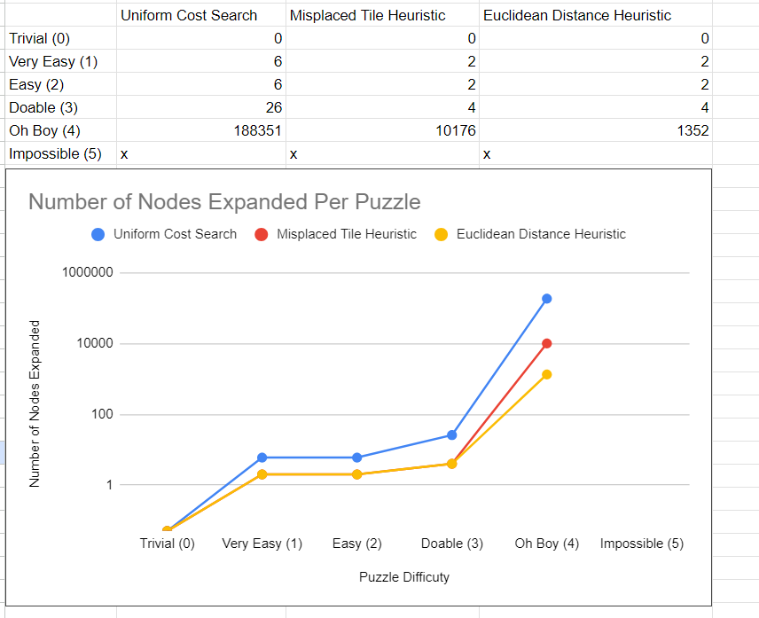

# CS170ProjectOne

Some of the challenges we faced were class design, language selection, expanding the nodes, and the search. We initially started our project off in C++ because that is what we are most familiar with but decided to switch to python as we thought it might be easier to tackle this type of problem with python. Because of this our initial switch of our driver code from C++ to python set us back a little bit, but we recovered.Expanding the nodes we had some initial errors due to the fact that we weren’t properly taking into account border conditions with the position of zero. Once fixing this however the expansion worked and was able to be implemented into our search. We were overcomplicating the search algorithm and writing three different searches. However, when reviewing we realized all the searches have the same functionality the only difference is the heuristic cost. And because uniform cost search doesn’t use a heuristic cost we can simply exclude that when we run the uniform cost search.

For class design we went with a Graph, Problem, and Node class structure.

**NODE CLASS**

The Node class initializes our node and stores: the zero\_position of the node (this is for knowing which operations we can perform), the parent node (for backtracking), the depth (for once we find the goal state), and also the path cost and total cost to use for each search. The functions we implemented inside the Node class calculate the different heuristics and also expand all possible new states of the current node. Having these variables and the functions allow each individual node to store necessary information and calculate on itself without needing to extend and use outside functions or classes.

**PROBLEM CLASS**

The Problem class stores all information for the overall problem and the values that need to be printed/returned at the end. It stores the initial\_state that either the user passes in or defaults to, the total number of expanded nodes, the max queue size, and also the goal depth. The functions it contains is the overall search function that can be used for all three options depending on the heuristic choice and the print function that returns which nodes we expanded, the goal depth, the total expanded nodes, the max queue size, and the path the search algorithm took to reach the goal state.

**GRAPH CLASS**

The Graph class contains all the information in regards to the current graph we are exploring and expanding. It stores the visited set to check for previously visited nodes, the root (the start of the graph), the initial zero position, and the frontier which is a priority queue to store the next nodes to expand (these are stored based on the smallest total cost having priority). The functions inside the class are all helper functions to check things within the frontier and visited set. There is an add to frontier function, a pop from frontier function, a mark as visited function, a find zero position function, and an is visited check function. 

We went with the Graph method instead of the Tree method because it would be much faster and ignore expanding states we have already visited. This is important especially when we get into more difficult 8-puzzle tests. To use a Graph instead of a Tree we implemented a visited set. Sets in python use hashing and have O(1) lookups, so using a set instead of iterating through an array each time helps with the overall speed when we check if a node has been previously visited. Another thing we included to speed up the overall time of the searches was to only calculate the position of the zero value once. We do this within the Graph class because we have to find it for the first initial node, then after this we store the new zero position each time when we expand the node. Since we are only making one swap with each different expansion we can store the new index of the zero blank space overall, speeding up our search.

